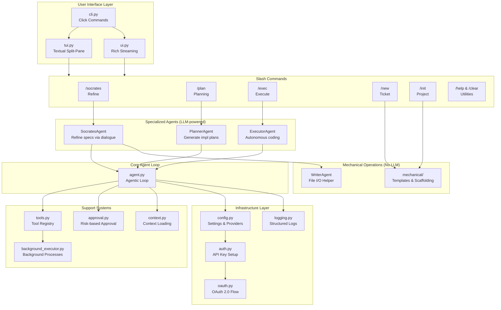
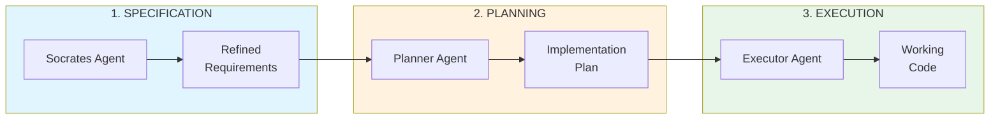
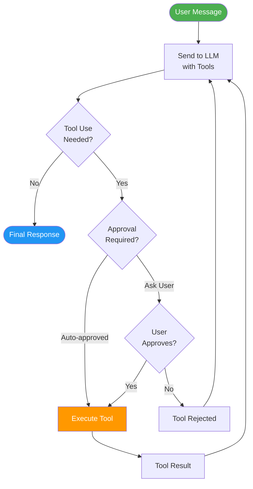
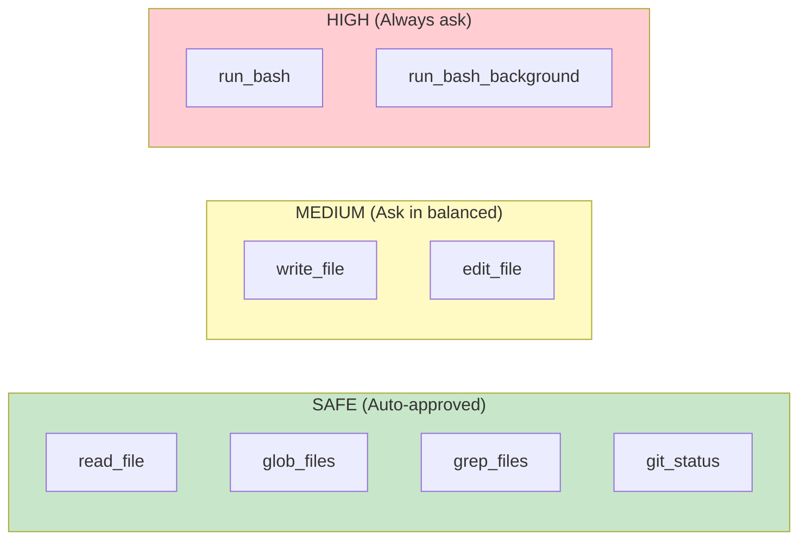
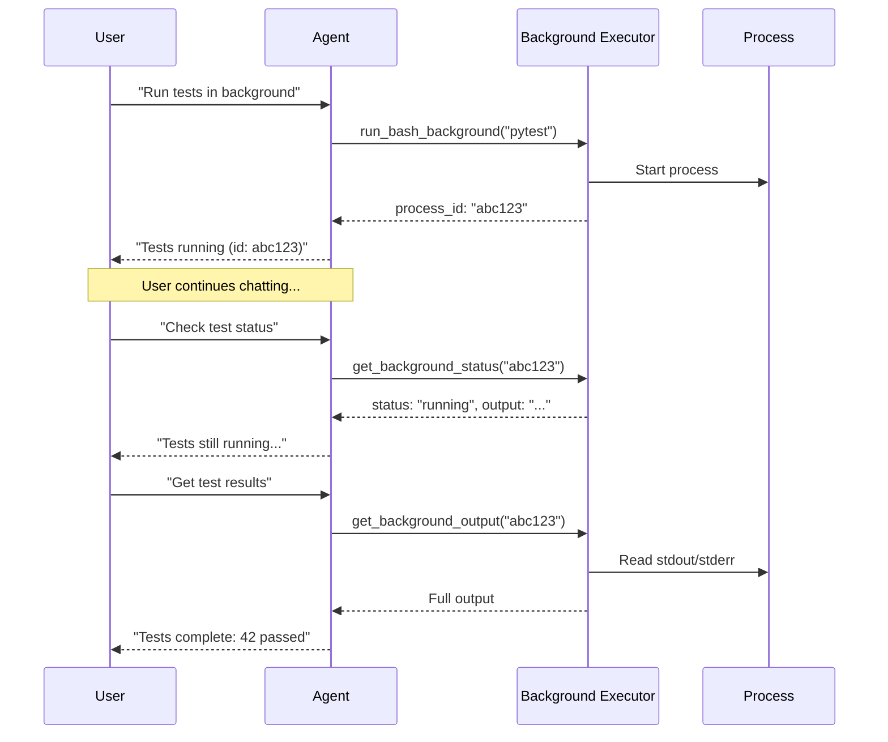
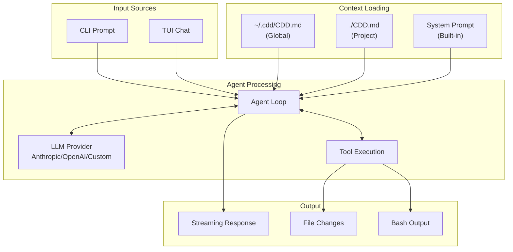
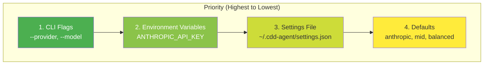
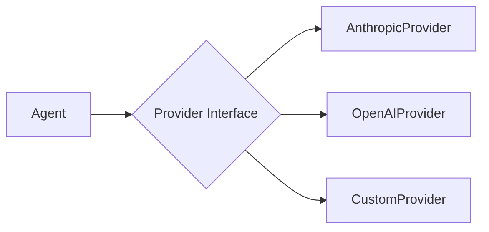

# CDD Agent Architecture

This document provides a visual overview of the CDD Agent architecture and explains how each component works together.

## High-Level Architecture

---

## The CDD Workflow

The core value proposition: **Spec → Plan → Execute**

---

## Core Agent Loop

The agentic loop that powers all interactions:

---

## Tool System

### Risk Levels

### Background Execution

---

## Data Flow

---

## Configuration Hierarchy

---

## Component Breakdown

### User Interface Layer

| File | Purpose |
|------|---------|
| `cli.py` | Click-based CLI entry point. Commands: `chat`, `auth`, `tui` |
| `tui.py` | Textual-based split-pane chat interface |
| `ui.py` | Rich streaming output for simpler terminal interactions |

### Slash Commands (`slash_commands/`)

| Command | File | Uses | Purpose |
|---------|------|------|---------|
| `/socrates` | `socrates_command.py` | SocratesAgent | Refine requirements through dialogue |
| `/plan` | `plan_command.py` | PlannerAgent | Generate implementation plans |
| `/exec` | `exec_command.py` | ExecutorAgent | Execute autonomous coding |
| `/new` | `new_command.py` | mechanical/ | Create new tickets (templates) |
| `/init` | `init_command.py` | mechanical/ | Initialize project structure |
| `/help` | `help_command.py` | - | Show available commands |
| `/clear` | `clear_command.py` | - | Clear conversation history |

### Specialized Agents (`agents/`)

| Agent | Type | Purpose |
|-------|------|---------|
| `SocratesAgent` | LLM | Uses Socratic method to refine specs through questioning |
| `PlannerAgent` | LLM | Generates step-by-step implementation plans from specs |
| `ExecutorAgent` | LLM | Autonomously executes code changes using tools |
| `WriterAgent` | I/O Helper | Simple file persistence (no LLM), used by other agents |

### Mechanical Operations (`mechanical/`)

Template-based operations that don't require LLM interaction:

| Module | Purpose |
|--------|---------|
| `init.py` | Project scaffolding (creates CDD.md, directories, configs) |
| `new_ticket.py` | Create tickets/docs from templates |
| `templates/` | Markdown templates for tickets, plans, docs |

### Core Agent Loop (`agent.py`)

The heart of the system implementing the ReAct pattern:
1. **Reason**: LLM decides what to do
2. **Act**: Execute tool if needed
3. **Observe**: Feed result back
4. **Repeat**: Until task complete

### Tool System (`tools.py`)

| Tool | Risk Level | Purpose |
|------|------------|---------|
| `read_file` | SAFE | Read file contents |
| `write_file` | MEDIUM | Write/modify files |
| `run_bash` | HIGH | Execute shell commands |
| `glob_files` | SAFE | Pattern-based file search |
| `grep_files` | SAFE | Regex search in files |

### Infrastructure Layer

| File | Purpose |
|------|---------|
| `config.py` | Settings management, provider configs, model tiers |
| `auth.py` | Authentication setup, API key validation |
| `oauth.py` | OAuth flow for Claude Pro/Max plans |
| `approval.py` | Tool execution approval (paranoid/balanced/trusting) |
| `context.py` | Load project context from CDD.md/CLAUDE.md |
| `logging.py` | Structured logging system |

---

## Design Patterns

### 1. Provider Pattern

### 2. Tool Registry Pattern
Decorator-based registration with auto-schema generation.

### 3. Configuration-Driven Design
Settings file with environment variable overrides and model tier abstraction.

---

## See Also

- [README.md](../README.md) - Installation and usage
- [ROADMAP.md](Roadmaps/ROADMAP.md) - Development roadmap
- [TOOLS_GUIDE.md](guides/TOOLS_GUIDE.md) - Tool documentation
- [USER_GUIDE.md](../USER_GUIDE.md) - User guide
