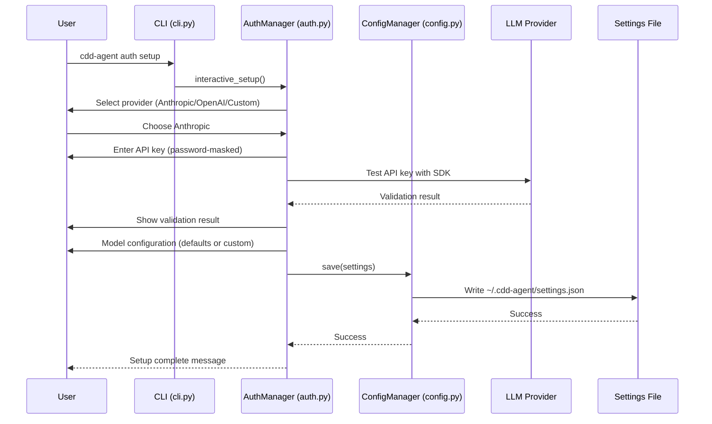
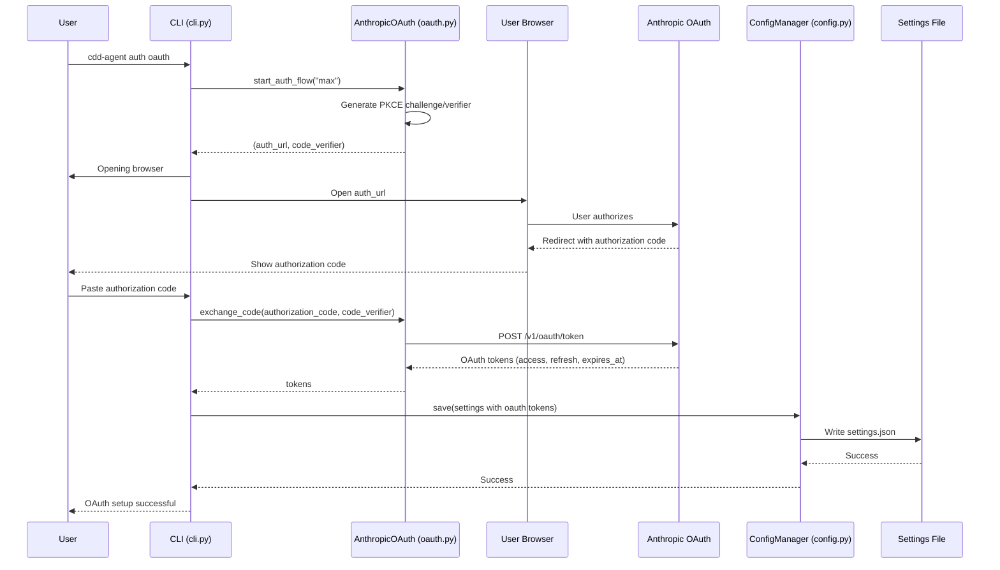
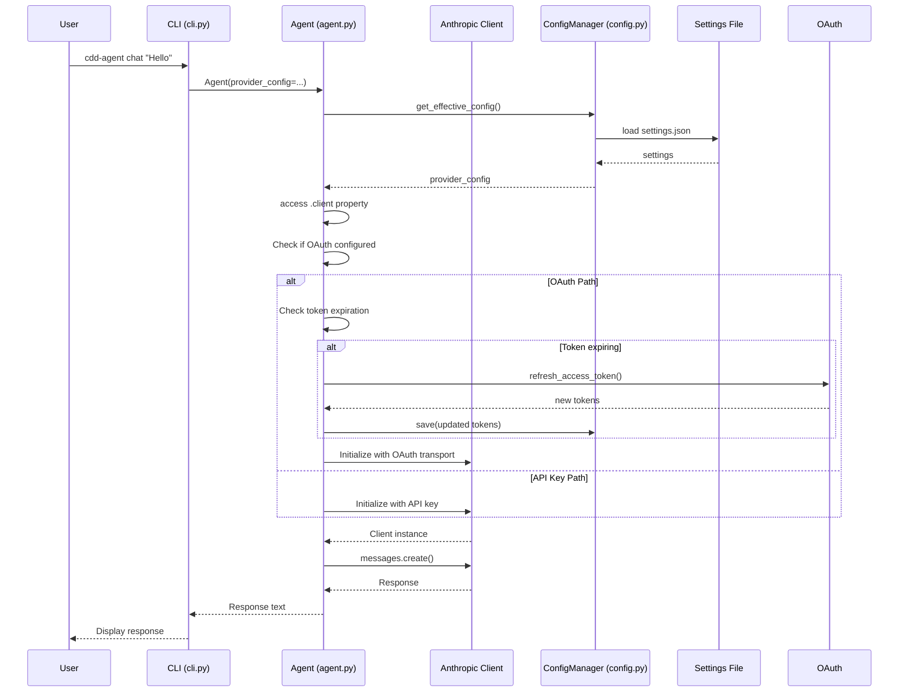

# Authentication System - Technical Documentation

## Overview

The CDD Agent authentication system is a comprehensive, multi-provider authentication framework that supports both traditional API key authentication and modern OAuth 2.0 flows. The system is designed to be LLM-agnostic, secure, and user-friendly, with seamless integration across multiple LLM providers including Anthropic, OpenAI, and custom endpoints.

## Architecture

### Core Components

The authentication system consists of several interconnected modules that work together to provide a unified authentication experience:

```
┌─────────────────┐    ┌──────────────────┐    ┌─────────────────┐
│   CLI Commands  │────│  AuthManager     │────│  ConfigManager  │
│   (cli.py)      │    │   (auth.py)      │    │  (config.py)    │
└─────────────────┘    └──────────────────┘    └─────────────────┘
         │                       │                        │
         │                       │                        │
         ▼                       ▼                        ▼
┌─────────────────┐    ┌──────────────────┐    ┌─────────────────┐
│   OAuth Flow    │    │   Agent Client   │    │  Settings File  │
│   (oauth.py)    │    │   Integration    │    │ ~/.cdd-agent/   │
└─────────────────┘    └──────────────────┘    └─────────────────┘
```

## Authentication Methods

### 1. API Key Authentication

**Supported Providers**: Anthropic, OpenAI, Custom (Anthropic/OpenAI-compatible)

**Flow Description**:
Users provide their API key during interactive setup, which is then stored in the settings file and used for all subsequent API calls.

**Technical Implementation**:
- Interactive validation using SDK test calls
- Secure storage in `~/.cdd-agent/settings.json`
- Environment variable overrides supported
- Direct SDK integration without custom HTTP transport

**Security Features**:
- Password-masked input during setup
- Immediate API validation
- Support for environment variable overrides
- No sensitive data in logs

**Example Configuration**:
```json
{
  "providers": {
    "anthropic": {
      "auth_token": "sk-ant-xxx-xxx-xxx",
      "base_url": "https://api.anthropic.com",
      "models": {
        "small": "claude-3-5-haiku-20241022",
        "mid": "claude-sonnet-4-5-20250929",
        "big": "claude-opus-4-20250514"
      }
    }
  }
}
```

### 2. OAuth 2.0 Authentication

**Supported Providers**: Anthropic (Claude Pro/Max plans only)

**⚠️ IMPORTANT LIMITATION**: Anthropic restricts OAuth tokens to work **only with official Claude Code application**. The "Max Mode" OAuth tokens return error 400 when used with third-party applications like cdd-agent. For third-party apps, use "Console Mode" to create a permanent API key instead.

**Flow Description**:
OAuth 2.0 flow with PKCE (Proof Key for Code Exchange) for secure authorization. Supports two modes:
- **Max Mode** ❌ (Restricted): Direct OAuth tokens - Only works with official Claude Code
- **Console Mode** ✅ (Recommended): Create permanent API key via OAuth - Works with all apps

**Technical Implementation**:
- PKCE implementation for enhanced security
- Automatic token refresh when nearing expiration
- Custom HTTP transport for OAuth Bearer token support
- Two-phase authentication (browser + CLI)

**OAuth Flow Architecture**:

1. **Authorization Phase**:
   ```
   User Action → CLI generates PKCE → Opens browser → User authorizes → Returns code
   ```

2. **Token Exchange Phase**:
   ```
   Authorization Code → CLI exchanges for tokens → Stores tokens → Ready for API calls
   ```

3. **Token Usage Phase**:
   ```
   API Call → Check expiration → Auto-refresh if needed → Use Bearer token → Success
   ```

**PKCE Implementation**:
```python
# Code generation and challenge creation
code_verifier = secrets.token_urlsafe(32)
code_challenge = create_s256_code_challenge(code_verifier)

# Authorization URL with PKCE parameters
auth_url = f"https://claude.ai/oauth/authorize?..."\
           f"code_challenge={code_challenge}&"\
           f"code_challenge_method=S256"
```

**Custom HTTP Transport**:
```python
class OAuthTransport(httpx.HTTPTransport):
    def handle_request(self, request: httpx.Request):
        # Remove x-api-key header (SDK default)
        if "x-api-key" in request.headers:
            del request.headers["x-api-key"]
        
        # Add OAuth Bearer token
        request.headers["Authorization"] = f"Bearer {self.access_token}"
        
        # Add required OAuth beta header
        request.headers["anthropic-beta"] = "oauth-2025-04-20,..."
        
        return super().handle_request(request)
```

**OAuth Configuration**:
```json
{
  "providers": {
    "anthropic": {
      "oauth": {
        "type": "oauth",
        "refresh_token": "rt_xxx",
        "access_token": "eyJxxx",
        "expires_at": 1731389456
      },
      "base_url": "https://api.anthropic.com",
      "models": {
        "small": "claude-3-5-haiku-20241022",
        "mid": "claude-sonnet-4-5-20250929",
        "big": "claude-opus-4-20250514"
      }
    }
  }
}
```

### 3. Environment Variable Authentication

**Supported Providers**: All (as overrides)

**Flow Description**:
Environment variables can override configuration file settings for flexible deployment scenarios.

**Priority Order**:
1. CLI flags (highest priority)
2. Environment variables
3. Configuration file
4. Default values (lowest priority)

**Supported Environment Variables**:
```bash
# API key overrides
export ANTHROPIC_API_KEY="sk-ant-xxx"
export CDD_AUTH_TOKEN="sk-ant-xxx"
export OPENAI_API_KEY="sk-xxx"

# Base URL overrides
export CDD_BASE_URL="https://custom-endpoint.com"
export ANTHROPIC_BASE_URL="https://custom-endpoint.com"

# Approval mode override
export CDD_APPROVAL_MODE="paranoid"
```

## Module Responsibilities

### CLI Commands (`src/cdd_agent/cli.py`)

**Responsibilities**:
- Command-line interface entry points
- User interaction handling
- Parameter validation and processing
- Lazy loading optimization

**Key Commands**:

1. **Authentication Commands**:
   ```python
   @auth.command(name="setup")
   def auth_setup():  # Interactive provider setup
   
   @auth.command(name="oauth") 
   def auth_oauth():  # OAuth flow setup
   
   @auth.command(name="status")
   def auth_status():  # Display current configuration
   
   @auth.command(name="set-default")
   def set_default():  # Change default provider
   
   @auth.command(name="test")
   def test_auth():  # Validate authentication
   ```

2. **Chat Command**:
   ```python
   @cli.command()
   def chat(...):  # Main chat interface with auth integration
   ```

**Lazy Loading Strategy**:
```python
# Ultra-lazy imports for maximum startup performance
if TYPE_CHECKING:
    from .agent import Agent
    from .ui import StreamingUI

# Only load when needed
if simple or no_stream:
    from .ui import StreamingUI
```

### Authentication Manager (`src/cdd_agent/auth.py`)

**Responsibilities**:
- Interactive setup orchestration
- Provider-specific configuration
- OAuth flow management
- API key validation
- Configuration display

**Key Classes and Methods**:

1. **AuthManager Class**:
   ```python
   class AuthManager:
       def __init__(self, config_manager: ConfigManager)
       def interactive_setup(self) -> Settings
       def setup_oauth_interactive(self, provider_name: str) -> None
       def display_current_config(self) -> None
   ```

2. **Provider Setup Methods**:
   ```python
   def _setup_anthropic(self) -> Settings
   def _setup_openai(self) -> Settings  
   def _setup_custom(self) -> Settings
   def _validate_anthropic_key(self, api_key: str) -> bool
   ```

3. **Interactive User Experience**:
   - Welcome screens with rich formatting
   - Provider selection with validation
   - Real-time API key testing
   - Model configuration with defaults
   - Success confirmation and file locations

### Configuration Management (`src/cdd_agent/config.py`)

**Responsibilities**:
- Settings file I/O operations
- Data validation with Pydantic
- Environment variable processing
- Provider configuration management
- Configuration directory management

**Key Classes**:

1. **Settings Model**:
   ```python
   class Settings(BaseModel):
       version: str = "1.0"
       default_provider: str = "anthropic"
       providers: Dict[str, ProviderConfig]
       approval_mode: ApprovalMode = ApprovalMode.BALANCED
       ui: Dict[str, Any] = Field(default_factory=dict)
       conversation: Dict[str, Any] = Field(default_factory=dict)
   ```

2. **Provider Configuration**:
   ```python
   class ProviderConfig(BaseModel):
       auth_token: Optional[str] = None
       api_key: Optional[str] = None
       oauth: Optional[OAuthTokens] = None
       base_url: str
       timeout_ms: int = 300000
       models: Dict[str, str]
       default_model: str = "mid"
       provider_type: Optional[str] = None
   ```

3. **OAuth Token Storage**:
   ```python
   class OAuthTokens(BaseModel):
       type: Literal["oauth"] = "oauth"
       refresh_token: str
       access_token: str
       expires_at: int
   ```

4. **ConfigManager Class**:
   ```python
   class ConfigManager:
       def __init__(self, config_dir: Optional[Path] = None)
       def ensure_config_dir(self) -> None
       def exists(self) -> bool
       def load(self) -> Settings
       def save(self, settings: Settings) -> None
       def get_effective_config(self, provider: Optional[str] = None) -> ProviderConfig
       def get_effective_approval_mode(self, override: Optional[str] = None) -> ApprovalMode
   ```

### OAuth Implementation (`src/cdd_agent/oauth.py`)

**Responsibilities**:
- OAuth 2.0 flow implementation
- PKCE challenge generation and validation
- Token exchange and refresh
- API key creation via OAuth
- HTTP client management

**AnthropicOAuth Class**:
```python
class AnthropicOAuth:
    def __init__(self)
    async def start_auth_flow(self, mode: str = "max") -> Tuple[str, str]
    async def exchange_code(self, authorization_code: str, code_verifier: str) -> Optional[dict]
    async def refresh_access_token(self, refresh_token: str) -> Optional[dict]
    async def create_api_key_from_oauth(self, authorization_code: str, code_verifier: str) -> Optional[str]
```

**OAuth Configuration**:
- Client ID: `9d1c250a-e61b-44d9-88ed-5944d1962f5e`
- Authorization endpoint: `https://claude.ai/oauth/authorize`
- Token endpoint: `https://console.anthropic.com/v1/oauth/token`
- PKCE: SHA-256 with S256 method
- Scopes: `org:create_api_key user:profile user:inference`

### Agent Integration (`src/cdd_agent/agent.py`)

**Responsibilities**:
- Lazy client initialization
- Authentication method detection
- Automatic token refresh
- Custom HTTP transport for OAuth
- Seamless API key/OAuth integration

**Client Property Implementation**:
```python
@property
def client(self):
    """Lazy initialization with OAuth support."""
    if self._client is None:
        if self._provider_config.oauth:
            # OAuth path with auto-refresh
            oauth_config = self._provider_config.oauth
            
            # Check if refresh needed (5-minute buffer)
            if time.time() >= (oauth_config.expires_at - 300):
                new_tokens = await oauth_handler.refresh_access_token(
                    oauth_config.refresh_token
                )
                # Update and persist tokens
                oauth_config.access_token = new_tokens["access_token"]
                oauth_config.expires_at = new_tokens["expires_at"]
                self.config_manager.save(self.settings)
            
            # Custom transport for OAuth
            http_client = httpx.Client(
                transport=OAuthTransport(oauth_config.access_token),
                timeout=600.0,
            )
            
            self._client = anthropic.Anthropic(
                api_key="dummy-key-will-be-replaced",
                base_url=self._provider_config.base_url,
                http_client=http_client,
            )
        else:
            # API key path
            self._client = anthropic.Anthropic(
                api_key=self._provider_config.get_api_key(),
                base_url=self._provider_config.base_url,
                # ... other parameters
            )
    return self._client
```

## Code Flow Integration

### 1. User Setup Flow



### 2. OAuth Flow



### 3. API Usage Flow



## Security Considerations

### Token Security

1. **Local Storage**:
   - OAuth tokens stored in `~/.cdd-agent/settings.json`
   - File permissions can be enforced (chmod 600)
   - No encryption at rest (future enhancement)

2. **Transmission Security**:
   - HTTPS for all OAuth requests
   - PKCE prevents authorization code interception
   - State parameter prevents CSRF attacks

3. **Token Lifecycle**:
   - Access tokens: ~1 hour expiration
   - Refresh tokens: Long-lived (no known expiration)
   - Automatic refresh with 5-minute buffer

### API Key Security

1. **Input Security**:
   - Password-masked input during setup
   - No keys in command line arguments
   - No keys in logs or error messages

2. **Storage Security**:
   - Local filesystem only
   - Environment variable support for sensitive environments
   - Configuration file in user home directory

### Environment Variable Security

1. **Override Priority**:
   - CLI flags > Environment variables > Config file > Defaults
   - Allows secure deployment in CI/CD environments

2. **Supported Variables**:
   - `ANTHROPIC_API_KEY`, `CDD_AUTH_TOKEN` - Anthropic keys
   - `OPENAI_API_KEY` - OpenAI keys
   - `CDD_BASE_URL`, `ANTHROPIC_BASE_URL` - Custom endpoints
   - `CDD_APPROVAL_MODE` - Security mode

## OAuth Limitations and Fixes

### Anthropic OAuth Restriction

**Discovery**: During implementation, we discovered that Anthropic restricts Claude Pro/Max OAuth tokens to work exclusively with the official Claude Code application.

**Error Message**:
```
Error 400: This credential is only authorized for use with Claude Code
and cannot be used for other API requests.
```

**Technical Reason**:
- Anthropic validates the client making requests
- OAuth tokens carry metadata about intended use
- Server-side enforcement prevents third-party usage
- This is a business decision to protect plan benefits

**Impact**:
- ❌ Zero-cost API access (Claude Pro/Max) NOT available for third-party apps
- ✅ OAuth "api-key" mode still works (creates regular API key)
- ✅ All OAuth infrastructure functional
- ⚠️ "Max mode" OAuth only for reference/official tools

### Implementation Fixes Applied

During OAuth implementation, we encountered and fixed several technical issues:

#### Fix #1: 401 Authentication Error

**Problem**: Initial implementation returned `401 - invalid x-api-key` error.

**Root Cause**:
- Anthropic's OAuth API requires `Authorization: Bearer` header
- Required special `anthropic-beta` header with OAuth feature flags
- Python Anthropic SDK always adds `x-api-key` header by default

**Solution**: Implemented custom `OAuthTransport` class:
```python
class OAuthTransport(httpx.HTTPTransport):
    def handle_request(self, request: httpx.Request):
        # Remove x-api-key header (added by SDK)
        if "x-api-key" in request.headers:
            del request.headers["x-api-key"]

        # Add OAuth Bearer token
        request.headers["Authorization"] = f"Bearer {self.access_token}"

        # Add required OAuth beta header
        request.headers["anthropic-beta"] = (
            "oauth-2025-04-20,claude-code-20250219,"
            "interleaved-thinking-2025-05-14,fine-grained-tool-streaming-2025-05-14"
        )

        return super().handle_request(request)
```

#### Fix #2: 400 Tool Schema Error

**Problem**: After fixing auth, got `400 - tools.0.custom.risk_level: Extra inputs are not permitted`

**Root Cause**:
- cdd-agent tools include custom `risk_level` field for approval system
- Anthropic's OAuth API is stricter and rejects custom tool fields
- Regular API key auth tolerates custom fields

**Solution**: Modified `ToolRegistry.get_schemas()`:
```python
def get_schemas(self, include_risk_level: bool = False) -> List[dict]:
    """Get tool schemas, optionally filtering custom fields."""
    schemas = list(self.schemas.values())

    if not include_risk_level:
        # Remove risk_level field for OAuth API compatibility
        schemas = [
            {k: v for k, v in schema.items() if k != "risk_level"}
            for schema in schemas
        ]

    return schemas

# Agent automatically detects OAuth and filters
include_risk = not bool(self._provider_config.oauth)
tools = self.tool_registry.get_schemas(include_risk_level=include_risk)
```

#### Fix #3: Credential Restriction

**Problem**: `400 - This credential is only authorized for use with Claude Code`

**Root Cause**: Fundamental limitation - Anthropic restricts OAuth tokens to official app only.

**Solution**:
- Document limitation clearly
- Recommend "api-key" mode instead of "max" mode
- Provide clear error messages and guidance
- Keep infrastructure for potential future use

### Workaround for Users

**Recommended Approach**:
```bash
# Run OAuth setup
cdd-agent auth oauth

# When prompted, choose:
# - "api-key" ✅ (creates permanent API key, works everywhere)
# - NOT "max" ❌ (restricted to Claude Code)

# Result: Browser-based API key creation
# Benefit: No manual console navigation
# Cost: Regular API pricing (not zero-cost)
```

**Alternative: Manual API Key**:
```bash
# Traditional approach still works
cdd-agent auth setup
# Manually enter API key from console.anthropic.com
```

## Error Handling

### Common Error Scenarios

1. **No Configuration Found**:
   ```python
   if not config.exists():
       console.print(
           "[bold red]No configuration found![/bold red]\n\n"
           "Please run [cyan]cdd-agent auth setup[/cyan] first..."
       )
   ```

2. **API Key Validation Failure**:
   ```python
   try:
       client.messages.create(...)
       return True
   except Exception as e:
       console.print(f"[dim]Validation error: {e}[/dim]")
       return False
   ```

3. **OAuth Credential Restricted to Claude Code**:
   ```
   Error 400: This credential is only authorized for use with Claude Code
   and cannot be used for other API requests.
   ```

   **Resolution**:
   - This is expected for "max" mode OAuth
   - Run `cdd-agent auth oauth` and choose "api-key" mode instead
   - Or use traditional `cdd-agent auth setup` for manual API key entry

4. **OAuth 401 Authentication Error**:
   ```
   Error 401: authentication_error - invalid x-api-key
   ```

   **Resolution**:
   - This should be automatically handled by custom HTTP transport
   - If encountered, verify `OAuthTransport` class is properly configured
   - Check that OAuth tokens are valid and not expired

5. **OAuth 400 Tool Schema Error**:
   ```
   Error 400: tools.0.custom.risk_level: Extra inputs are not permitted
   ```

   **Resolution**:
   - This should be automatically handled by schema filtering
   - Agent detects OAuth and removes custom fields
   - If encountered, verify `get_schemas(include_risk_level=False)` is being called
## Summary

### Authentication Methods Comparison

| Method | Providers | Setup Complexity | Security | Use Case |
|--------|-----------|------------------|----------|----------|
| **API Key** | All | Low (paste key) | Medium | Standard usage, all providers |
| **OAuth "api-key"** | Anthropic | Medium (browser flow) | High (OAuth 2.0) | Convenient API key creation |
| **OAuth "max"** | Anthropic | Medium (browser flow) | High (OAuth 2.0) | ❌ Restricted to Claude Code only |
| **Environment Variable** | All | Low (export var) | Low | CI/CD, temporary override |

### Recommendations

**For Most Users:**
- Use `cdd-agent auth setup` - Simple, direct, works everywhere
- Choose your provider (Anthropic/OpenAI/Custom)
- Enter API key when prompted

**For OAuth Preference:**
- Use `cdd-agent auth oauth` 
- **Choose "api-key" mode** (not "max")
- Benefit: Browser-based setup, no console navigation
- Note: Regular API pricing (not zero-cost)

**For CI/CD:**
- Use environment variables:
  ```bash
  export ANTHROPIC_API_KEY="sk-ant-..."
  cdd-agent chat "Run tests"
  ```

**For Claude Pro/Max Subscribers:**
- Zero-cost access **only available via official Claude Code**
- cdd-agent uses regular API pricing regardless of plan
- Use cdd-agent for flexibility, Claude Code for zero-cost

### Implementation Status

**✅ Fully Implemented:**
- API key authentication for all providers
- OAuth 2.0 with PKCE security
- Automatic token refresh
- Custom HTTP transport for OAuth
- Tool schema filtering for OAuth compatibility
- Environment variable overrides
- Multi-provider configuration
- Interactive setup wizard

**⚠️ Known Limitations:**
- OAuth "max" mode restricted to Claude Code (Anthropic's policy)
- No token encryption at rest (future enhancement)
- No OAuth for OpenAI (not supported by provider)
- No OAuth for custom endpoints (provider-dependent)

**🔜 Future Enhancements:**
- Token encryption at rest
- OAuth support for additional providers
- Team/shared configuration management
- Configuration migration tools
- Enhanced security audit logging

## Related Documentation

- [OAUTH_IMPLEMENTATION.md](/OAUTH_IMPLEMENTATION.md) - Complete OAuth implementation details
- [OAUTH_LIMITATION.md](/OAUTH_LIMITATION.md) - OAuth restrictions and workarounds
- [OAUTH_TESTING.md](/OAUTH_TESTING.md) - OAuth testing guide
- [README.md](/README.md) - General authentication setup guide

---

**Last Updated:** 2025-11-11  
**Version:** 0.0.4  
**Status:** Production Ready (with documented OAuth limitation)
